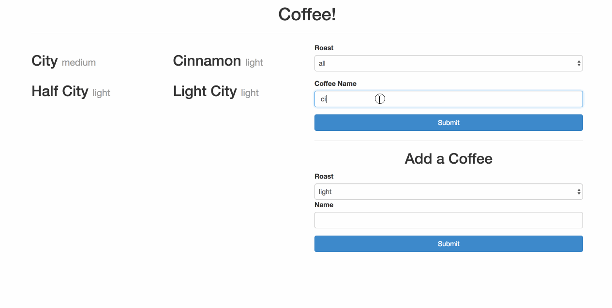

# Coffee Project

Congratulations! You have landed your first development job! You have inherited
a project from Fancy Coffee Company&copy;, and they want you to make
improvements to it.

## Setup

1. ONE TEAMMATE DOES THIS PART
1. Create a Github organization and add your teammate(s).
1. Create the repo "coffee-project" on that organization
1. In IdeaProjects, run
    - git clone --bare git@github.com:CodeupClassroom/coffee-project.git
    - cd coffee-project.git
    - git push --mirror [your new repo ssh url]
    - in GitHub, rename master to main
    - cd .. from coffee-project.git to IdeaProjects
    - delete coffee-project.git
    - git clone [your new repo]
    - cd into that repo
    - you're project is ready now!
1. All teammates clone down now!

## GUIDELINES

- Read, analyze, and identify all parts of the existing HTMl/JS before changing a single piece of code
    - Describe what each function does by itself (without thinking of surrounding code)
    - Describe the flow of the code when a user:
        - loads the page initially
        - searches for a specific coffee

- Do NOT touch styling until all functionality (Todos AND Bonuses) are in place and BUG-FREE

- DO format your HTML layout in preparation for doing layout/styling later
    - Make containers for
        - Coffee display
        - Search/Filter Form
        - Adding/Removing Coffees
    - Wrap those containers appropriately in a parent container (their row, yeah?)
    

## TODO

- Refactor HTML and DOM node creation
    - We have to stop using HTML table elements
    - Create an HTML div container for rendering individual coffees within
    - renderCoffee(coffee) should not return table elements, but rather a div containing text elements for each coffee property
    - renderCoffee and renderCoffees should be using modern DOM methods instead of the assignment operator (=) for adding to the DOM

- As a user, all coffees are displayed on page load in ascending id order (1 thru x)

- As a user, I can search by name and roast

- As a user, I see displayed coffees filter in real-time based on selections of name and roast
    - A side result is you may not need a submit button for this form!

## BONUS

- As a user, my coffee name search is case-insensitive

- As a user, I can add and remove coffees
  
- As a user, I see coffees have descriptions and more properties

- As a user, my added and removed coffees are available when I reload
    - This can be accomplished by use of local storage

- Once coffees are persisted to local storage, coffees can become named objects
    - Then, they can be created on-the-fly from local storage and used by DOM methods

## On Style

- Bootstrap the layout
    - Mobile and Desktop are fine, don't get in the weeds with breakpoints
    - Containers with row classes, children as columns
        - Children as columns could also be a row to THEIR children, and so on
- On Design:
    - Less is more
    - Be aware of negative space: too much too close together creates visual noise
    - Be intentional about where the user's eye should go and when

## Example

Here is an example demonstrating the above functionality. Your application might
look different, but should have the same features.

## SUPER DUPER ZIPPITY DOO-DAH BONUS

**NOT TO BE DONE UNTIL ALL OF THE ABOVE IS COMPLETED**

- As a user, I see a description of coffees when I hover over an individual coffee in the UI

- The program loads all children of the body by the DOM

